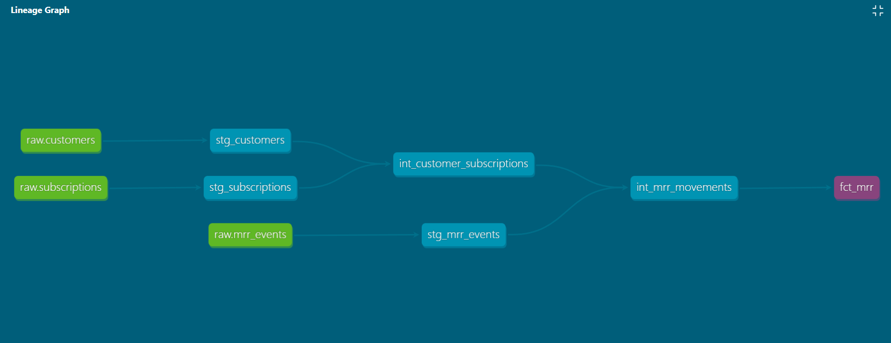

# SaaSMetrics Analytics Platform

An end-to-end analytics engineering project simulating a real SaaS business 
intelligence platform — built to demonstrate production-grade data engineering 
practices.

## Stack
- **Ingestion:** Python (pandas, faker)
- **Warehouse:** Snowflake
- **Transformation:** dbt (staging → intermediate → marts)
- **Reporting:** Looker (LookML views and explores on dbt marts)
- **CI/CD:** GitHub Actions (automated dbt build and tests on every push)

## Architecture

Raw data is ingested via Python scripts into Snowflake's raw schema. dbt 
transforms raw data through three layers — staging, intermediate, and marts — 
following analytics engineering best practices. Looker connects to the marts 
layer via LookML for reporting and exploration. GitHub Actions automatically 
runs dbt build on every push to main, ensuring all models and data quality 
tests pass before changes reach production.

## Domain

SaaS business metrics including MRR waterfall (new, expansion, churned), 
customer lifetime value, churn analysis, and subscription analytics.

## Data Pipeline

### Ingestion
- `generate_data.py` — generates realistic fake SaaS data using Faker
- `load_to_snowflake.py` — loads CSV files into Snowflake raw schema

### Transformation (dbt)
- **Staging** — raw source cleaning and column standardization
  - `stg_customers` — 200 customers with signup dates
  - `stg_subscriptions` — 200 subscriptions across 4 plans
  - `stg_mrr_events` — 265 MRR events (new, expansion, churned)
- **Intermediate** — business logic and joins
  - `int_customer_subscriptions` — customers joined to subscriptions
  - `int_mrr_movements` — MRR events enriched with customer context
- **Marts** — final tables for reporting
  - `fct_mrr` — MRR fact table with waterfall components
  - `dim_customers` — customer dimension with subscription attributes

### Data Quality
- 34 automated dbt tests across staging and marts
- Tests include: unique, not_null, accepted_values, relationships
- All tests run automatically on every CI pipeline execution

## Lineage Graph

## MRR Waterfall

| Event Type | Count | Total MRR |
|---|---|---|
| New | 200 | +$64,340 |
| Expansion | 27 | +$16,010 |
| Churned | 38 | -$11,992 |
| **Net MRR** | | **$68,358** |

## Project Structure
saas-metrics/
├── .github/
│   └── workflows/
│       └── dbt_ci.yml        # GitHub Actions CI pipeline
├── ingestion/
│   ├── generate_data.py      # Fake SaaS data generation
│   └── load_to_snowflake.py  # Snowflake loader
├── transform/                # dbt project
│   └── models/
│       ├── staging/          # Raw source cleaning
│       ├── intermediate/     # Business logic
│       └── marts/            # Reporting tables
├── analysis/                 # Ad hoc SQL
├── docs/                     # Architecture assets
└── requirements.txt

## CI/CD

Every push to main triggers a GitHub Actions pipeline that:
1. Installs Python dependencies
2. Configures dbt with Snowflake credentials from GitHub Secrets
3. Runs `dbt build` — all models and all 34 tests
4. Fails the pipeline if any model or test fails

## Status
✅ Active — ingestion, transformation, and CI/CD complete. LookML in progress.